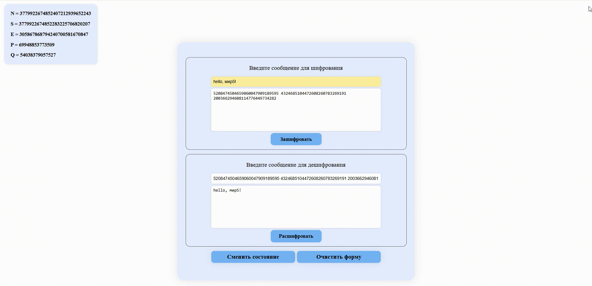

# Веб-приложение для шифрования и дешифрования сообщений с использованием RSA

Это простое веб-приложение для демонстрации работы алгоритма RSA.  
**Backend:** ASP.NET Core (C#)  
**Frontend:** React  
**Шифрование:** Пользовательская библиотека `RSALibrary`

---

## **Функционал**
- Шифрование сообщений с использованием RSA.
- Дешифрование зашифрованных сообщений.
- Генерация новых ключей (`p`, `q`, `n`, `s`, `e`).
- Просмотр текущего состояния RSA (публичные и приватные ключи).

